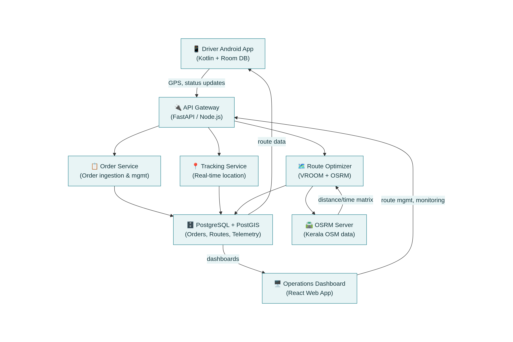
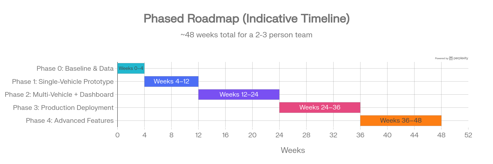

# Smart Delivery-Route System: Complete Design Document
## Kerala Local Delivery Business — Cargo Three-Wheeler Fleet
---
## 1. Problem Framing and VRP Model
### Which VRP Variant Fits
Your business involves multiple vehicles (cargo three-wheelers), each with a cargo capacity limit (~500 kg), delivering to many customers within a compact 5 km radius. This maps directly to the **Capacitated Vehicle Routing Problem (CVRP)** — the classic variant where a fleet of vehicles with limited capacity must serve a set of customers from a central depot, minimizing total distance or time.[^1][^2]

Given your operational context, the recommended progression of VRP variants is:

| Stage | VRP Variant | When to Use |
|-------|------------|-------------|
| **Start here** | CVRP | Multiple vehicles, capacity limits, no time windows yet |
| **Phase 2** | VRPTW (VRP with Time Windows) | When you add customer delivery slots (e.g., "deliver between 10–12 AM") |
| **Phase 3** | MDHVRPTW (Multi-Depot Heterogeneous VRP with TW) | If you open a second depot or add electric vehicles with different specs |
| **Future** | PDPTW (Pickup-and-Delivery with TW) | If you handle returns or pickup-and-delivery in the same route |

For a 5 km radius with perhaps 50–150 stops per day split across several vehicles, the problem is computationally manageable — far smaller than what modern solvers handle routinely.[^3][^4]
### Exact vs. Heuristic Approaches
**Exact methods** (e.g., branch-and-bound, mixed-integer programming) guarantee optimal solutions but become computationally infeasible beyond ~20–30 stops per vehicle. For your problem size, **heuristic and meta-heuristic approaches** are the clear choice:[^3][^4]

- **Constructive heuristics** (nearest-neighbor, Clarke-Wright savings): Build a feasible solution quickly — useful as a starting point or fallback.[^5][^6]
- **Meta-heuristics** (Large Neighborhood Search, Simulated Annealing, Tabu Search): Iteratively improve a solution. VROOM uses custom meta-heuristics that deliver near-optimal results in milliseconds.[^7]
- **Google OR-Tools** uses guided local search and Large Neighborhood Search, providing good solutions for VRPTW problems with hundreds of nodes.[^4][^3]

**Recommendation:** Start with VROOM's built-in meta-heuristics for daily batch optimization. For complex custom constraints later, migrate to OR-Tools which offers finer control.[^7][^3]

***
## 2. Landscape of Existing Solutions
### Optimization Engines
| Engine | License | VRP Types | Speed | Self-Host | Best For |
|--------|---------|-----------|-------|-----------|----------|
| **VROOM** | BSD-2-Clause | TSP, CVRP, VRPTW, MDHVRPTW, PDPTW | Milliseconds | Docker, easy | Quick deployment, all-in-one VRP [^7] |
| **Google OR-Tools** | Apache 2.0 | CVRP, VRPTW, custom constraints | Seconds | pip install | Custom constraints, large-scale problems [^3][^4] |
| **OptaPlanner** | Apache 2.0 | CVRP, VRPTW | Moderate | Java-based | Java ecosystems, incremental updates [^3] |
| **VeRyPy** | MIT | CVRP (15 classical heuristics) | Fast | pip install | Learning, benchmarking, prototyping [^8] |

**Primary recommendation: VROOM** — it supports all the VRP variants you need, solves in milliseconds, integrates directly with OSRM/Valhalla, models vehicle capacity, time windows, driver breaks, and working hours out of the box, and has a Docker image for easy deployment. Its BSD-2-Clause license allows unrestricted commercial use.[^7]

**Secondary/fallback: Google OR-Tools** — for when you need constraints VROOM doesn't model natively (e.g., custom penalty functions, non-linear costs). OR-Tools has excellent Python bindings and Google's official VRPTW tutorials.[^4][^9]
### Routing Backends (Distance/Time Matrix)
| Engine | License | Key Strength | Memory Needs | Update Cycle | India Suitability |
|--------|---------|-------------|--------------|--------------|-------------------|
| **OSRM** | BSD-2-Clause | Fastest routing queries | Higher RAM (~2-4 GB for Kerala) | Manual re-extract | Good — Kerala OSM data is ~130-168 MB PBF [^10][^11] |
| **Valhalla** | MIT | Flexible, isochrones, lower RAM (tiled) | Lower (loads tiles on demand) | Easier incremental | Good — tiled architecture efficient for regional use [^12] |
| **Openrouteservice** | LGPL | Rich API (isochrones, elevation) | Higher | Manual | Good — built on OSM, Java-based |

**Recommendation: OSRM** for Phase 1–2 (speed is paramount for daily route computation; Kerala's map data is small enough to fit comfortably in memory). Consider **Valhalla** if you later need isochrone analysis or run on constrained hardware.[^13][^12]

Kerala's OpenStreetMap data is well-maintained thanks to an active community that intensified mapping during the 2018 floods and continues through regular mapping parties and the OpenDataKerala initiative. The Kerala `.osm.pbf` file is ~130–168 MB, manageable on any modern server.[^14][^15][^16][^10][^11]
### Off-the-Shelf Platforms (Plan B)
**Fleetbase** is an open-source modular logistics OS that includes order management, route optimization, a driver app (Navigator) with offline support, GPS tracking, proof of delivery, and a web dashboard — all self-hostable via Docker. If building from scratch proves too ambitious initially, Fleetbase is a strong "80% solution" you can deploy quickly and customize over time.[^17][^18][^19]

Other commercial options: Route4Me, Track-POD (has free driver app with offline sync), and LogisticsOS — useful as benchmarks but introduce vendor lock-in.[^20][^21]

***
## 3. Kerala-Specific Constraints and Pitfalls
### Regulatory and Safety Context
Kerala's Motor Vehicles Department (MVD) issued notices to Blinkit, Swiggy, Zepto, and Bigbasket in December 2025, directing them to align delivery operations with road safety regulations within 15 days. The MVD identified "7-minute" and "20-minute" delivery promises as a key factor leading to speeding, reckless riding, and failure to wear helmets. This triggered a nationwide directive from the Union government to halt "10-minute delivery" marketing claims.[^22][^23][^24]

**Implications for your system:**
- Build in realistic travel time estimates with safety buffers (e.g., 1.3× multiplier on OSRM times for three-wheelers)
- Never display countdown timers or time pressure to drivers
- Set minimum delivery windows (30–60 minutes) rather than exact ETAs
- Log speed data and flag instances above safe thresholds (e.g., >40 km/h in urban areas)
- Document your safety-first approach — this is a regulatory and liability advantage
### Practical Challenges
**Addressing and geocoding:**
- Indian addresses are highly unstructured, multilingual, and use informal landmarks ("near the temple," "opposite petrol pump").[^25][^26]
- Research shows open-source geocoding achieves only 2–5% accuracy on informal Indian addresses, vs. Google Maps at ~63% and OLA Maps at ~41%.[^27]
- The GeoIndia project demonstrated 50%+ improvement over Google Maps using ML-based geocoding specifically trained on Indian addresses.[^26][^25]

**Geocoding strategy:**
1. **Start with Google Maps Geocoding API** — most reliable for Indian addresses, cache every result to minimize API costs
2. **Supplement with customer-provided Google Maps links** — extract coordinates directly from URLs
3. **Build a local address-to-coordinate cache** in PostgreSQL/PostGIS, growing over time
4. **Long-term:** Evaluate India-specific geocoding services (Latlong.ai claims 4× better accuracy than Google for Indian addresses)[^28]

**Road network challenges:**
- Narrow one-way streets not always mapped in OSM — validate critical routes manually in early phases
- Inconsistent house numbering — rely on GPS coordinates + driver's local knowledge
- Heavy monsoon rain (June–September) increases travel times by 30–50% — build seasonal time multipliers into the model
- GPS drift in dense urban areas — use Kalman filtering on telemetry data and snap-to-road algorithms

**Mobile connectivity:**
- Patchy 4G in some areas — the driver app **must** work offline with pre-downloaded routes and map tiles[^29][^30]
- Use Android's WorkManager for background sync when connectivity returns[^29]
- Queue status updates (delivered, failed) locally and sync in batch[^31]

***
## 4. Vehicle Fleet Profile
The Piaggio Ape Xtra LDX is the reference vehicle for your routing model:[^32][^33]

| Parameter | Diesel/CNG | Electric |
|-----------|-----------|----------|
| Payload capacity | 496–532 kg [^32] | 506 kg [^34] |
| Max speed | 56–60 km/h [^32] | 45 km/h [^34] |
| Realistic urban speed | 15–25 km/h | 12–20 km/h |
| Range per fill/charge | ~200–250 km (10L tank) | 70–80 km [^34] |
| Dimensions (L×W×H) | 3145 × 1490 × 1770 mm [^32] | Similar |
| Turning radius | 3.8 m [^32] | Similar |
| Ground clearance | 245 mm [^32] | Similar |

**Key modeling implications:**
- Set OSRM vehicle profile to **a custom profile** between car and bicycle — the Ape is slower than a car but uses car-width roads. Use `car.lua` profile with reduced speed limits (cap at 40 km/h urban, 50 km/h suburban).
- Model capacity constraints in VROOM as weight-based (use the 496 kg payload limit with a 90% utilization factor = 446 kg effective).
- If electric Ape vehicles are added, model range constraints as a maximum route distance of ~60 km (80% of rated range for safety).

***
## 5. Data Requirements and Collection Plan
### Minimal Dataset to Start (Phase 0–1)
**Orders:** Order ID, customer ID, full address text, latitude/longitude, delivery date, weight in kg, priority, any special instructions.

**Vehicles:** Registration number, type (diesel/CNG/electric), max payload, current status.

**Drivers:** Name, phone, assigned vehicle, shift start/end times.
### Richer Data for Continuous Improvement (Phase 2+)
- **Planned vs. actual routes** — compare optimizer output to GPS traces
- **Timestamps at each stop** — planned arrival, actual arrival (GPS-derived), departure
- **Delivery outcome** — success, failed (reason: customer absent, wrong address, refused)
- **Empirical travel times** — per road segment, by time of day, by season (monsoon vs. dry)
- **Service time at stop** — actual minutes spent delivering, for better future estimation
### Data Capture via Driver App
Capture data with **minimal friction** for drivers:
- **Automatic GPS tracking** every 10–30 seconds (background service, battery-optimized)
- **One-tap "Arrived" and "Delivered" buttons** — timestamp recorded automatically
- **Optional photo proof** — camera opens with one tap, uploaded when on WiFi
- **Failure reason picker** — 4–5 common reasons as radio buttons, no typing needed
- **All data queued locally** in Room DB and synced via WorkManager when network is available[^29][^30]
### Concrete Data Schema
The schema includes six core tables: `orders` (20 columns), `vehicles` (11), `drivers` (8), `routes` (14), `route_stops` (12), and `telemetry` (12). All spatial data uses PostGIS geometry types with SRID 4326 (WGS84). The telemetry table uses TimescaleDB or time-based partitioning for efficient querying of GPS traces.[^35][^36]

***
## 6. System Architecture and Tech Stack

### Component Breakdown
**Backend Services (Python/FastAPI or Node.js):**
- **Order Service:** Ingests daily orders from CSV/Excel/API, runs geocoding, validates data
- **Route Optimizer Service:** Calls VROOM API with the day's orders + vehicle fleet → returns optimized routes
- **Tracking Service:** Receives GPS pings from driver apps, writes to telemetry table, provides real-time location via WebSockets
- **API Gateway:** Single entry point for both driver app and web dashboard, handles auth (JWT tokens)

**Optimization Layer:**
- **OSRM** (self-hosted, Docker): Computes distance/time matrices from Kerala OSM data. Download `kerala.osm.pbf` (~130–168 MB), pre-process with `osrm-extract` and `osrm-contract`, run `osrm-routed` on port 5000[^37][^38]
- **VROOM** (self-hosted, Docker): Receives jobs (deliveries) and vehicles definition, queries OSRM for the cost matrix, returns optimized routes in JSON[^7]

**Database: PostgreSQL 15+ with PostGIS 3.x**
- Handles all relational data + geospatial queries[^36][^39]
- Spatial indexes (GiST) for fast proximity queries
- Consider TimescaleDB extension for high-volume telemetry data

**Driver Android App (Kotlin):**
- Offline-first architecture: Room DB as source of truth, network as sync channel[^29][^30]
- Map display using Mapbox SDK (free tier) or MapLibre (open-source) with pre-cached tiles for the 5 km service area
- Stop list with one-tap status updates
- Background GPS tracking via ForegroundService
- WorkManager for reliable background sync[^29]

**Operations Web Dashboard (React + Leaflet/MapLibre GL):**
- Daily route overview on map
- Drag-and-drop route adjustment
- Real-time driver positions
- Delivery completion metrics
- Order management interface
### Deployment
For a small team, start with **cloud deployment** (AWS, DigitalOcean, or Hetzner):
- Single VPS (4 vCPU, 8 GB RAM, 100 GB SSD) can run OSRM + VROOM + PostgreSQL + FastAPI backend — total cost ~$30–60/month
- Docker Compose for orchestration
- Later, if needed: move to managed services (RDS for PostgreSQL, ECS for containers)

OSRM self-hosting for Kerala specifically requires modest resources: the pre-processed Kerala graph fits in ~1–2 GB RAM.[^13][^10]
### Batch + Incremental Optimization
- **Daily batch:** At a cut-off time (e.g., 7 AM), run VROOM with all orders → generate all routes for the day
- **Incremental re-optimization:** When new orders arrive mid-day or a driver reports a delay, re-run VROOM with the remaining undelivered stops + new orders. VROOM's millisecond solve time makes this practical even for frequent re-runs.[^7]

***
## 7. Project Plan and Phases

### Phase 0: Baseline & Data Collection (Weeks 1–4)
**Goals:** Understand current process, establish data foundation.

**Tasks:**
- Shadow current manual route planning for 1–2 weeks; document how dispatchers decide
- Digitize address list: collect GPS coordinates for top 100 recurring customer locations
- Set up Google Maps Geocoding API, geocode historical addresses, cache results
- Install PostgreSQL + PostGIS, create initial schema
- Download Kerala OSM data, spin up OSRM in Docker locally

**Data readiness:** Customer address database with coordinates for ≥80% of frequent addresses.

**Success criteria:** A clean, geocoded address database and a working OSRM instance returning travel times for Kerala roads.
### Phase 1: Single-Vehicle Prototype (Weeks 5–12)
**Goals:** Prove optimization works for one vehicle, one day's deliveries.

**Tasks:**
- Integrate VROOM with OSRM — solve a single-vehicle TSP/CVRP for 15–30 stops
- Build a minimal Android app: display ordered stop list + route on map (read-only, no tracking yet)
- Compare optimizer output vs. the driver's manual route (distance, time)
- Iterate on OSRM speed profile to match real three-wheeler travel times

**Data readiness:** Daily order list with coordinates, one vehicle's specs.

**Success criteria:** Optimizer-generated route is measurably shorter (by ≥15%) than manual route on ≥70% of test days. Driver confirms the route is driveable and realistic.
### Phase 2: Multi-Vehicle + Dashboard (Weeks 13–24)
**Goals:** Full fleet optimization with time windows, basic operations dashboard.

**Tasks:**
- Expand to multi-vehicle CVRP/VRPTW in VROOM with capacity and shift constraints
- Build the FastAPI backend: order ingestion, optimizer trigger, route API
- Add GPS tracking to driver app (background service, 15-second intervals)
- Build basic React dashboard: daily route map, stop list per vehicle, completion status
- Add "Delivered" / "Failed" buttons + photo capture to driver app
- Implement offline-first sync (Room + WorkManager)

**Data readiness:** All vehicles and drivers registered, time windows for ≥50% of orders.

**Success criteria:** All vehicles receive optimized routes daily. Dashboard shows real-time progress. On-time delivery rate improves by ≥10% vs. Phase 1.
### Phase 3: Production Deployment (Weeks 25–36)
**Goals:** Stable, reliable system used daily by all drivers and ops staff.

**Tasks:**
- Deploy to cloud (Docker Compose on VPS)
- Automated daily OSM data refresh (weekly or bi-weekly OSRM rebuild)
- Add driver shift management, break scheduling
- Implement mid-day re-optimization when new orders arrive
- Build proof-of-delivery workflow (photo + signature)
- Set up monitoring (Grafana), alerting, and daily backup

**Data readiness:** 3+ months of telemetry and delivery data.

**Success criteria:** System uptime ≥99%. All routes generated automatically. Operations team no longer plans routes manually.
### Phase 4: Advanced Features (Weeks 37–48+)
**Goals:** Learning from data, dynamic optimization, operational intelligence.

**Tasks:**
- Build empirical travel-time models per road segment and time-of-day
- Implement dynamic re-routing on driver delay or vehicle breakdown
- Add monsoon-season time multipliers (trained on Phase 2–3 data)
- Customer notification system (SMS/WhatsApp) with ETA
- Predictive demand modeling for staffing/vehicle allocation
- Explore electric vehicle range-constrained routing

**Data readiness:** 6+ months of planned-vs-actual route data.

**Success criteria:** Route time estimates within ±10% of actuals. Deliveries per vehicle per day increase by ≥20% vs. pre-system baseline.

***
## 8. Metrics, Evaluation, and Continuous Improvement
### Core Metrics
| Metric | Formula | Target | Who Cares |
|--------|---------|--------|-----------|
| **Distance per delivery** | Total km ÷ stops delivered | Minimize (benchmark: 0.5–1.5 km in 5km radius) | Ops, Finance |
| **Time per delivery** | Total route time ÷ stops | <8–12 min avg including transit + service | Ops, Drivers |
| **On-time rate** | Deliveries within promised window ÷ total | ≥90% | Customers, Mgmt |
| **Deliveries per vehicle/day** | Completed stops per vehicle | Track trend upward | Ops, Finance |
| **Route plan adherence** | Stops in optimizer sequence ÷ total stops | ≥85% (driver followed plan) | Ops, Tech |
| **First-attempt success** | Delivered on first try ÷ total | ≥95% | Customers, Ops |
| **Driver workload balance** | Std deviation of stops across drivers | Minimize | HR, Drivers |
| **Planned vs. actual time** | Actual route time ÷ planned route time | 0.9–1.1 (±10%) | Tech (model accuracy) |
| **Safety: max speed events** | GPS pings >40 km/h in urban zone | 0 | Safety, Regulatory |
### Before/After Comparison
Run a **2-week pilot** with optimizer-planned routes for half the fleet while the other half continues manual planning. Compare:
- Total km driven per delivery
- Deliveries completed per vehicle
- Driver-reported ease of use (simple survey)
- Customer complaints
### Continuous Improvement Loop
1. Collect planned-vs-actual data from every route
2. Weekly: compare OSRM estimated travel times to GPS-measured actuals per road segment
3. Monthly: retrain travel-time multipliers by road segment and hour-of-day
4. Quarterly: update OSRM with latest OSM data (community improvements to Kerala maps)
5. Feed delivery success/failure data back to geocoding confidence scores — flag addresses with repeated failures for manual correction

***
## 9. Alternative and Complementary Options
### If Full Self-Hosting is Too Complex Initially
**Hybrid approach (recommended as Plan B):**
- Use **Google Maps Directions API** or **Mapbox Directions** for distance/time matrix (pay-per-use, ~$5–10/day for your volume)
- Run VROOM locally with the external matrix — VROOM accepts custom cost matrices, not just OSRM[^7]
- This avoids self-hosting OSRM while keeping optimization in-house

**Simpler heuristic routing (interim Phase 0.5):**
- Cluster nearby orders using k-means or geographic quadrants
- Within each cluster, apply nearest-neighbor sequencing[^40][^5]
- Implementable in <100 lines of Python — gives 70–80% of optimal results

**Off-the-shelf backup:**
- **Fleetbase** (open-source) — deploy the entire stack including driver app in days[^18][^19]
- **Track-POD** — free driver app with proof of delivery, paid route optimization[^21]
- **Route4Me** — commercial SaaS with Indian market support[^20]
### Non-Technical Process Changes
These process improvements amplify the routing system's effectiveness:

- **Time-slotted bookings:** Offer customers AM (9–12) and PM (1–5) slots — reduces VRPTW complexity and sets realistic expectations
- **Minimum order lead time:** Require 2-hour lead time for same-day delivery to allow batch optimization
- **Daily cut-off time:** Orders placed after 5 PM go to next-day batch
- **Area-based delivery days:** If feasible, serve different zones on different days (Mon = Zone A, Tue = Zone B) — dramatically reduces route distances
- **Standardized addresses:** Ask customers to save a Google Maps pin on first order; reuse forever

***
## 10. Risks and Mitigation
### Technical Risks
| Risk | Impact | Mitigation |
|------|--------|------------|
| Poor geocoding accuracy | Wrong routes, failed deliveries | Cache verified coordinates; use Google Maps API + customer pins; manual correction for repeat failures [^27] |
| OSM map gaps (unmapped lanes) | Router suggests impossible routes | Validate routes in key areas; contribute corrections to OSM; allow driver to report "road not passable" |
| OSRM speed profile mismatch | Over-optimistic travel times | Calibrate with real GPS data from Phase 1; apply 1.3× safety multiplier initially |
| Solver performance/scaling | Slow route generation | VROOM solves 200+ stops in <1 second — not a risk at your scale [^7] |
| GPS drift in dense areas | Inaccurate telemetry | Snap-to-road algorithm; Kalman filter; discard pings with accuracy >50m |
| Patchy mobile data | Failed syncs, stale routes | Offline-first app design with Room DB + WorkManager [^30][^29] |
### Regulatory and Safety Risks
| Risk | Impact | Mitigation |
|------|--------|------------|
| Unsafe speed pressure | Accidents, MVD enforcement | No countdown timers; flag speed >40 km/h; set realistic 30–60 min delivery windows [^22][^24] |
| Regulatory scrutiny | Fines, operational disruption | Document safety-first approach; comply proactively with MVD directives [^23] |
| Accident liability | Legal, financial | Enforce helmet policy; log compliance; maintain driver training records |
### Operational Risks
| Risk | Impact | Mitigation |
|------|--------|------------|
| Driver adoption resistance | Unused system, wasted investment | Involve drivers in testing from Phase 1; keep UI dead-simple (large buttons, Malayalam support); show them time savings |
| Device failures | Missing tracking data, lost routes | Pre-download route to device; routes work offline; provide backup devices |
| Dispatcher resistance to change | Manual overrides defeating the system | Side-by-side pilot showing clear improvement; give dispatchers adjustment tools in dashboard |
| Key-person dependency | System unmaintainable | Document everything; use mainstream tech (Python, PostgreSQL, Docker); avoid exotic dependencies |
### Gradual Rollout Plan
1. **Week 1–2:** Shadow mode — optimizer generates routes, drivers follow their usual route, compare results
2. **Week 3–4:** Advisory mode — show optimizer route on app, driver can choose to follow or not
3. **Week 5+:** Active mode — drivers follow optimizer route, with override button for exceptions
4. **Month 3+:** Default mode — optimizer routes are standard, manual planning only for edge cases

***
## 11. Recommended Starting Stack Summary
| Component | Choice | Reason |
|-----------|--------|--------|
| **Optimization engine** | VROOM | Solves CVRP/VRPTW in ms, Docker, BSD-2 license, OSRM-native [^7] |
| **Routing engine** | OSRM (self-hosted) | Fastest queries, Kerala OSM data fits easily, Docker setup [^12][^37] |
| **Database** | PostgreSQL 15 + PostGIS 3.x | Spatial queries, mature, open-source, good for telemetry [^36][^39] |
| **Backend API** | Python FastAPI | Async, fast, great for a small team, OR-Tools compatible |
| **Driver app** | Kotlin Android (offline-first) | Room DB + WorkManager + MapLibre [^30] |
| **Ops dashboard** | React + MapLibre GL JS | Real-time map, lightweight |
| **Geocoding** | Google Maps API (cached) | Best reliability for Indian addresses initially [^27] |
| **Deployment** | Docker Compose on cloud VPS | Simple, affordable ($30–60/month) |
| **Map data** | OpenStreetMap (Kerala) | Active community, well-mapped, free [^16][^14] |

***
## 12. Metrics Dashboard Layout
### Driver View (Android App)
- Today's route: ordered list of stops with addresses and map
- Next stop highlighted with navigation button
- Running count: "12 of 18 stops completed"
- One-tap: "Arrived" → "Delivered" / "Failed (reason)"
### Operations Dashboard (Web)
- **Map view:** All active vehicles as moving dots, color-coded by status (green=on-time, yellow=delayed, red=stuck)
- **Route panel:** Select a vehicle → see its planned route, completed stops (green), upcoming (blue), skipped (red)
- **Daily summary cards:** Total deliveries completed, on-time %, average time per delivery, total distance
- **Comparison chart:** Today vs. 7-day average vs. pre-system baseline
- **Alerts feed:** Vehicle stopped >15 min, driver speed >40 km/h, route deviation >500m, failed delivery
### Management Dashboard (Weekly/Monthly)
- Trend lines: deliveries per day, on-time %, cost per delivery
- Vehicle utilization: payload % per route, idle time
- Driver performance: stops per shift, on-time %, workload balance
- Address quality: geocoding failure rate, repeat-failed addresses

This design gives your non-technical co-founder a clear, visual understanding of performance without requiring any technical knowledge.

---

## References

1. [On-demand last mile transportation: Real-time route ...](https://carto.com/blog/last-mile-transportation-route-optimization) - Discover how spatial analysis enhances last-mile transportation, optimizing routes for efficiency an...

2. [Vehicle Routing Optimization for Sustainable Last-Mile ...](https://ijettjournal.org/Volume-72/Issue-9/IJETT-V72I9P136.pdf) - Based on the literature review, a mathematical model seeks to optimize a sustainable Vehicle. Routin...

3. [Comparing VRP Solvers: OR-Tools, OptaPlanner, & SaaS ...](https://www.singdata.com/trending/comparing-vrp-solvers-ortools-optaplanner-saas/) - Compare VRP solvers like OR-Tools, OptaPlanner, and SaaS APIs. Discover their strengths, limitations...

4. [VRP Solver: OR-Tools vs. SCIP for Your Complex Routing ...](https://edana.ch/en/2026/02/01/route-optimization-or-tools-vs-scip-which-solver-for-your-complex-vehicle-routing-problems/) - This article compares two leading frameworks—Google OR-Tools and SCIP—through a real-world Vehicle R...

5. [Nearest neighbour algorithm - Wikipedia](https://en.wikipedia.org/wiki/Nearest_neighbour_algorithm)

6. [Heuristics for Vehicle Routing Problem: A Survey and ...](https://arxiv.org/pdf/2303.04147.pdf) - by F Liu · 2023 · Cited by 66 — The simplest constructive heuristic for VRPs is probably the nearest...

7. [VROOM-Project/vroom: Vehicle Routing Open-source Optimization ...](https://github.com/VROOM-Project/vroom) - Vehicle Routing Open-source Optimization Machine. Contribute to VROOM-Project/vroom development by c...

8. [yorak/VeRyPy: A python library with implementations of 15 ...](https://github.com/yorak/VeRyPy) - VeRyPy is an easy to use Python library of classical algorithms for CVRPs with symmetric distances.

9. [Vehicle Routing Problem with Time Windows | OR-Tools](https://developers.google.com/optimization/routing/vrptw)

10. [Download OpenStreetMap for India](https://download.geofabrik.de/asia/india.html) - Download OpenStreetMap data for India for self-hosting or data analysis ... Data processed by Geofab...

11. [Index of /extracts/asia/india](https://download.openstreetmap.fr/extracts/asia/india/) - kerala.osm.pbf, 2026-02-17 00:52, 168M. [TXT], kerala.state.txt, 2026-02-17 00:52, 56 ... Apache/2.4...

12. [Top 10 Open-Source Tools for Route Optimization in 2025](https://nextbillion.ai/blog/top-open-source-tools-for-route-optimization) - Vroom is an open-source vehicle routing engine known for its simplicity and speed, designed to solve...

13. [Comparing Matrix Routing Services](https://www.logisticsos.com/blog/distance-matrix) - in this blog post, we will explore all the pons and cons of the origin-destination routing matrix (O...

14. [State of the Map Kerala 2025/Community](https://wiki.openstreetmap.org/wiki/State_of_the_Map_Kerala_2025/Community) - The project aims to create detailed, up-to-date maps that highlight Kerala's lush greenery, serene b...

15. [OpenDataKerala](https://wiki.openstreetmap.org/wiki/OpenDataKerala)

16. [Welcome to OSM Kerala.](https://kerala.openstreetmap.in/posts/osm/) - An overview of OSM Kerala's inspiring journey and continued efforts to strengthen the use of OSM in ...

17. [Fleetbase Navigator: The Open-Source Driver App for Smarter Deliveries](https://www.youtube.com/watch?v=5hqg7cSPVAk) - A walk through Fleetbase Navigator – the open-source driver app built for real-time logistics and de...

18. [Fleetbase | Open-Source Logistics Platform for Modern Supply Chain Operations](https://www.fleetbase.io) - Fleetbase is the open-source logistics platform for building scalable delivery, fleet, and supply ch...

19. [Modular logistics and supply chain operating system (LSOS)](https://github.com/fleetbase/fleetbase) - Modular logistics and supply chain operating system (LSOS) - fleetbase/fleetbase

20. [Best Route Planning And Route Optimization Software](https://route4me.com) - Trusted route planning and route optimization software for your business. Ensure accurate, efficient...

21. [Track-POD: Delivery Management Software, Proof of Delivery ...](https://www.track-pod.com) - Using our delivery management software's web dashboard, you can track your drivers and deliveries, a...

22. [7-minute delivery taking a toll on road safety? Kerala warns ...](https://www.indiatoday.in/india/kerala/story/kerala-mvd-notices-blinkit-swiggy-zepto-bigbasket-reckless-delivery-riding-2840950-2025-12-24) - Kerala's Motor Vehicles Department has directed leading quick-commerce platforms to align delivery o...

23. [Kerala MVD warns quick-commerce firms over rash driving ...](https://economictimes.com/industry/services/retail/kerala-mvd-warns-quick-commerce-firms-over-rash-driving-by-riders/articleshow/126153325.cms) - Speeding, rash riding and failure to wear safety gear such as helmets were identified as some of the...

24. [Kerala's road safety drive triggers nationwide curb on '10-minute ...](https://www.newindianexpress.com/states/kerala/2026/Jan/17/keralas-road-safety-drive-triggers-nationwide-curb-on-10-minute-delivery-claims) - THIRUVANANTHAPURAM: What began as a road safety intervention by the motor vehicles department (MVD) ...

25. [A Seq2Seq Geocoding Approach for Indian Addresses](https://aclanthology.org/2024.emnlp-industry.29/) - Bhavuk Singhal, Anshu Aditya, Lokesh Todwal, Shubham Jain, Debashis Mukherjee. Proceedings of the 20...

26. [GeoIndia: A Seq2Seq Geocoding Approach for Indian Addresses](https://chatpaper.com/chatpaper/paper/78511) - GeoIndia is an advanced geocoding system that utilizes a Seq2Seq framework with hierarchical H3-cell...

27. [Where exactly are you? Geocoding for Disaster Response in ...](https://euridice.eu/where-exactly-are-you/) - In this thesis, master student Adithya Vasisth explores whether contemporary geocoding services and ...

28. [Geocoding for India's Complexity Boosts Accuracy 4x](https://www.linkedin.com/posts/onze_geocoding-locationintelligence-builtforindia-activity-7424759506972209152-l-5h) - Most global maps are built for simple, structured Western addresses. We built geocoding for India's ...

29. [Build Apps That Keep Working When the Network Doesn't](https://dev.to/mohan_sankaran/offline-first-android-build-apps-that-keep-working-when-the-network-doesnt-3m39) - Introduction Mobile connectivity isn’t “good” or “bad” — it’s inconsistent. Shopping...

30. [Build an offline-first app | App architecture - Android Developers](https://developer.android.com/topic/architecture/data-layer/offline-first)

31. [The Complete Guide to Offline-First Architecture in Android](https://androidengineers.substack.com/p/the-complete-guide-to-offline-first) - Introduction

32. [Piaggio Ape Xtra LDX Specifications - TrucksDekho](https://trucks.cardekho.com/en/trucks/piaggio/ape-xtra-ldx-bs6/specifications) - The Piaggio Ape Xtra LDX offers in 599 cc. Its payload capacity is 496 Kgs, GVW 975 kg and wheelbase...

33. [Piaggio Apé Xtra LDX 230cc CNG](https://piaggio-cv.co.in/cargo/ape-xtra-ldx-230-cng/) - The Piaggio Apé Xtra LDX 230 cargo vehicle offers excellent load-carrying capacity and a best-in-cla...

34. [Piaggio Ape Electrik (electric) Vehicle Specifications - Turno](https://www.turno.club/blog/piaggio-ape) - Piaggio Ape Electrik (electric) is one of the best Commercial Three wheeler electric vehicle, this c...

35. [PostgreSQL Real-time Position Tracking + Trace Analysis ...](https://www.alibabacloud.com/blog/postgresql-real-time-position-tracking-%20-trace-analysis-system-practices-processing-100-billion-tracesday-with-a-single-server_597196) - In this article, the author discusses PostgreSQL-based real-time position tracking and trace analysi...

36. [Applying Postgis for Storage and Processing of Geospatial Data in ...](https://emergingsociety.org/index.php/efltajet/article/view/275) - Join a global community of researchers and innovators sharing open-access knowledge and hosting inte...

37. [How to Set Up a Local OSRM Server with Docker and ...](https://www.linkedin.com/pulse/how-set-up-local-osrm-server-docker-integrate-r-python-fulponi-tvlcf) - Step 1: Download the OSM Data File · Step 2: Extract the Routing Graph · Step 3: Partition and Custo...

38. [Introduction to OSRM: Setting up osrm-backend using Docker](https://blog.afi.io/blog/introduction-to-osrm-setting-up-osrm-backend-using-docker/) - The quickest way to get started with OSRM is to run the main routing engine (osrm-backend) on your l...

39. [Geospatial PostgreSQL for Enterprise Applications - PostGIS ...](https://perryrobinson.com/blog/geospatial-postgresql-enterprise-applications/) - Comprehensive guide to implementing geospatial features in enterprise applications using PostgreSQL ...

40. [Clustering and heuristics algorithm for the vehicle routing ...](https://www.growingscience.com/ijiec/Vol13/IJIEC_2021_32.pdf) - The heuristic Nearest Neighbor “is a constructive method for generating initial feasible solutions f...

